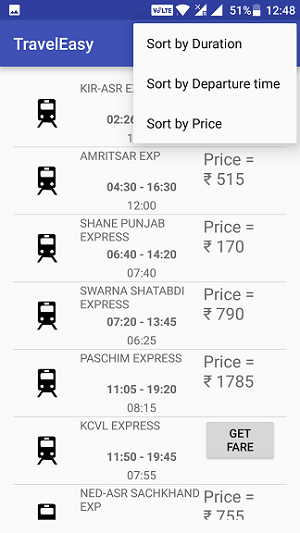
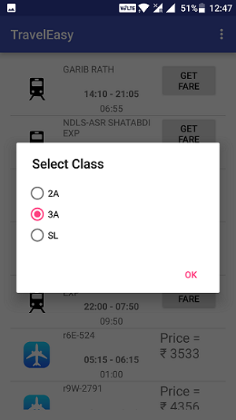
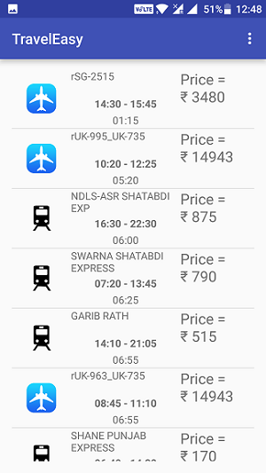

Android app to compare trains and flights between user's choice of source and destination
Note : Add following dependencies in app/build.gradle
      compile 'com.squareup.retrofit2:retrofit:2.1.0'
      compile 'com.squareup.retrofit2:converter-gson:2.1.0'
      compile 'com.readystatesoftware.sqliteasset:sqliteassethelper:+'
Also, add your own API key from http://railwayapi.com/api/

